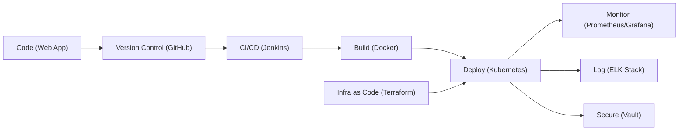

# Project Beacon — Emergency Response Coordination Platform


**Project Beacon** is a highly resilient DevOps ecosystem built to support an Emergency Response Coordination Platform for a national disaster management agency. The platform provides real-time emergency incident management, resource tracking, and inter-agency coordination capabilities.

Given that lives are at stake during emergencies, this project emphasizes **zero tolerance for downtime**, **automated recovery**, **massive scalability**, and **comprehensive observability**.

---

## 🚀 Features

### Core Business Application (Node.js/Express)
- **Incident Dashboard**: Real-time overview of active critical emergencies.
- **Resource Tracking**: Tracking standby and deployed assets (ambulances, fire trucks, rescue teams).
- **Incident Reporting**: Multi-step dispatch reporting for initiating new emergencies.
- **Government "Command Center" UI**: An ultra-premium, dark-navy interface designed for rapid situational awareness.

### DevOps & Infrastructure
- **Containerization**: Dockerized application with multi-stage builds.
- **Orchestration**: Fully managed Kubernetes deployments (Deployments, Services, Ingress, ConfigMaps, HPA).
- **CI/CD Automation**: Jenkins pipelines for automated testing, building, and deployment.
- **Infrastructure as Code (IaC)**: Terraform scripts for provisioning scalable cloud networks and compute instances.
- **Observability**: Prometheus & Grafana for metrics and alerting; ELK Stack (Elasticsearch, Logstash, Kibana) for centralized logging.
- **Security**: HashiCorp Vault for secure storage and injection of application secrets.

---

## 🏗️ Architecture



---

## 🛠️ Quick Start (Local Setup)

### Prerequisites
- Node.js & npm
- Docker Desktop
- Minikube & `kubectl`
- Terraform
- Jenkins (via Homebrew/Docker)

### 1. Run the Application Locally
```bash
npm install
npm run dev
```
Navigate to `http://localhost:3000` to view the Command Center dashboard.

### 2. Provision Infrastructure (Terraform)
```bash
cd terraform
terraform init
terraform plan
terraform apply
cd ..
```

### 3. Deploy to Local Kubernetes (Minikube)
Ensure your Minikube cluster is running (`minikube start --driver=docker`), then apply the manifests:
```bash
kubectl apply -f k8s/
kubectl apply -f monitoring/
kubectl apply -f logging/
kubectl apply -f vault/
```
Verify the deployments using `kubectl get pods -A`.

---

## 📁 Repository Structure

- `/src`: Node.js Application Source Code (Controllers, Routes, Public UI)
- `/docker`: Dockerfiles and `docker-compose.yml`
- `/k8s`: Kubernetes Manifests (Deployments, Services, HPA)
- `/terraform`: AWS Infrastructure Provisioning Scripts
- `/jenkins`: Jenkinsfile for CI/CD Pipeline
- `/monitoring`: Prometheus configs and Grafana dashboards
- `/logging`: Filebeat and ELK stack configurations
- `/vault`: HashiCorp Vault policies and secrets configurations
- `/docs`: Project documentation and presentation flows

---

## 🛡️ Security & Reliability

- **Self-Healing**: Kubernetes automatically restarts failed pods.
- **Auto-Scaling**: Horizontal Pod Autoscalers (HPA) scale the application during disaster-induced traffic spikes.
- **Secret Management**: API keys and database credentials are fully decoupled from the source code and injected securely at runtime via Vault.

---

*Case Study 47 — Developed for advanced DevOps and resilient systems engineering.*
