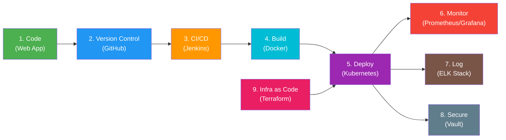

# Case Study 47: Project Beacon — Emergency Response Coordination Platform

---

## 1. Project Context & Background

A **national disaster management agency** coordinates emergency response activities involving multiple stakeholder organizations:

| Stakeholder | Role |
|---|---|
| Hospitals | Medical emergency response & triage |
| Police Departments | Law enforcement & crowd control |
| Fire Services | Fire suppression & hazmat response |
| Rescue Teams | Search & rescue operations |
| Government Agencies | Policy, funding & inter-agency coordination |

The platform processes **four key data streams** in real-time:

1. **Incident Reports** — Real-time reports from the field
2. **Geographic Information** — Location/mapping data for incidents & resources
3. **Communication Feeds** — Inter-agency messaging & alerts
4. **Emergency Resource Allocation** — Tracking & dispatching of personnel, vehicles, supplies

---

## 2. Problem Statement

The existing infrastructure has critical weaknesses exposed during natural disasters:

| Problem | Impact |
|---|---|
| **Traffic Spikes** | System struggles when volumes increase dramatically during disasters |
| **Communication Failures** | Inter-agency communication breaks down |
| **Deployment Delays** | Slow rollout of updates & fixes during emergencies |
| **Limited Monitoring** | Poor visibility into system health & performance |

> [!CAUTION]
> These failures directly impact **emergency response effectiveness** — meaning lives are at stake. The platform must be designed with zero tolerance for downtime during large-scale emergencies.

---

## 3. Objective

> Build a **highly resilient DevOps ecosystem** supporting emergency response operations, automated infrastructure management, and uninterrupted service delivery.

The solution must demonstrate:

- ✅ **Automated Recovery** — Self-healing infrastructure
- ✅ **Scalability** — Handle nationwide traffic spikes during disasters
- ✅ **Observability** — Full monitoring, logging & alerting
- ✅ **Secure Communications** — Encrypted, authenticated inter-agency comms

---

## 4. Critical Requirement: Working Business Application

> [!IMPORTANT]
> You are **NOT** expected to build only Jenkins pipelines, Docker containers, Terraform scripts, or Kubernetes deployments.
>
> You **must first build a small working business application** related to the assigned domain, and then implement the complete DevOps lifecycle around it.
>
> The application can be simple and demonstrate core functionality only.

### Application to Build

**Emergency Incident Management Portal** — a web-based dashboard/API that demonstrates core emergency response coordination functionality.

#### Suggested Core Features (minimal viable scope)

| Feature | Description |
|---|---|
| Incident Reporting | Create, view, update emergency incidents |
| Incident Dashboard | Real-time overview of active incidents on a map or list |
| Resource Tracking | Track available resources (ambulances, fire trucks, personnel) |
| Status Updates | Update incident status (reported → responding → resolved) |
| Agency Assignment | Assign incidents to appropriate response agencies |
| Communication Feed | Simple messaging/alert system between agencies |

---

## 5. Complete Deliverables Checklist

### 5.1 Application & Source Code

| # | Deliverable | Description |
|---|---|---|
| 1 | **Working Application** | Web App / Dashboard / API for Emergency Incident Management |
| 2 | **Source Code Repository** | Hosted on GitHub with proper branching strategy |

---

### 5.2 Containerization & Orchestration

| # | Deliverable | Description |
|---|---|---|
| 3 | **Dockerfile & Docker Images** | Containerized application with multi-stage builds |
| 4 | **Kubernetes Deployment Files** | Deployments, Services, Ingress, ConfigMaps, HPA, etc. |

---

### 5.3 CI/CD

| # | Deliverable | Description |
|---|---|---|
| 5 | **Jenkins CI/CD Pipeline** | Automated build → test → deploy pipeline |

---

### 5.4 Infrastructure as Code

| # | Deliverable | Description |
|---|---|---|
| 6 | **Terraform Infrastructure Scripts** | Provisioning cloud infrastructure (VPC, compute, networking, etc.) |

---

### 5.5 Monitoring & Logging

| # | Deliverable | Description |
|---|---|---|
| 7 | **Monitoring — Prometheus & Grafana** | Metrics collection, dashboards, alerting |
| 8 | **Logging — ELK Stack** | Elasticsearch, Logstash, Kibana for centralized logging |

---

### 5.6 Security

| # | Deliverable | Description |
|---|---|---|
| 9 | **Secret Management — HashiCorp Vault** | Secure storage & injection of secrets (API keys, DB creds, certs) |

---

### 5.7 Documentation & Diagrams

| # | Deliverable | Description |
|---|---|---|
| 10 | **Architecture Diagram** | High-level system architecture showing all components |
| 11 | **Deployment Diagram** | How the application is deployed across environments |
| 12 | **Disaster Recovery Plan** | RTO/RPO targets, backup strategy, failover procedures |
| 13 | **Project Documentation** | README, setup guides, runbooks |
| 14 | **Demonstration Screenshots** | Visual evidence of working system at each stage |

---

## 6. DevOps Lifecycle Summary

The following diagram shows how all deliverables connect in the DevOps lifecycle:

---

## 7. Key Design Principles

| Principle | How to Achieve |
|---|---|
| **Resilience** | Kubernetes self-healing, multi-replica deployments, health checks |
| **Scalability** | Horizontal Pod Autoscaler (HPA), load balancing |
| **Observability** | Prometheus metrics, Grafana dashboards, ELK centralized logging |
| **Security** | Vault for secrets, TLS encryption, RBAC in Kubernetes |
| **Automation** | Jenkins pipelines, Terraform IaC, GitOps workflows |
| **Disaster Recovery** | Documented DR plan, backup/restore procedures, failover strategies |

---

## 8. Guiding Philosophy

> *"Build a small but functional business application first. Then demonstrate how DevOps tools automate deployment, scaling, monitoring, recovery, and security of that application."*

---

*Last updated: 2026-06-21*
